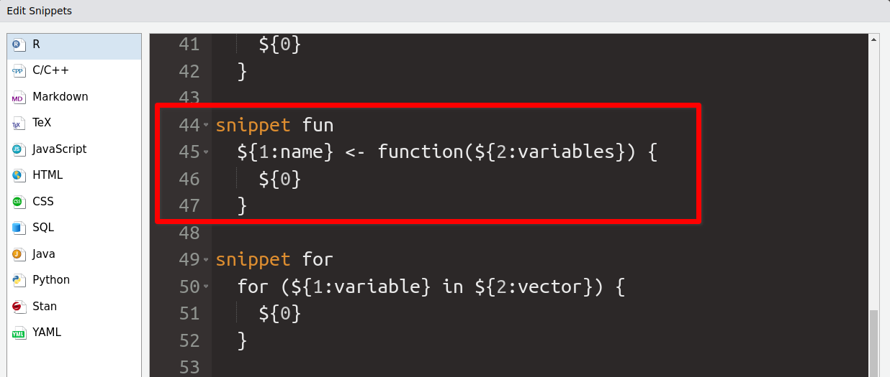
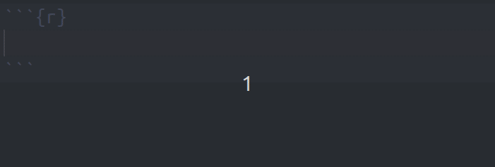
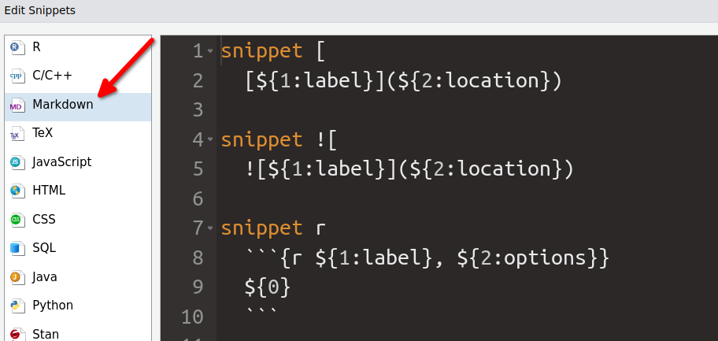
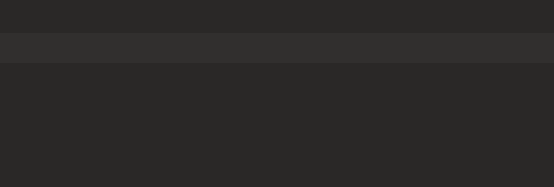

# Use snippets in RStudio to repeat common patterns
Albert Rapp
Invalid Date

<!-- Not sure how to connect this to consulting work -->

Sometimes it’s the little things that can give you a productivity speed boost. That’s why we’ve already looked into [great RStudio keyboard shortcuts](https://rfortherestofus.com/2023/11/rstudio-hotkeys) that can make your programming life easier.

In today’s blog post, we want to highlight another one of RStudio’s excellent features, namely reusuable code snippets. For example, check out this function:

``` r
add_numbers <- function(x, y) {
  x + y
}
```

Here, I’ve created a simple function that adds two vectors. There are two ways to create this:

1.  Write this all out (including all of the special characters `<-`, `(`, `)` etc.) OR
2.  Use a code snippet and fill the skeleton

Take a look at how the second way works:


Did you see how RStudio created most of the code for me? That was the magic of the `fun` snippet. It’s one of those pre-defined snippets that come installed with RStudio. Let’s talk about how this works and how you can define your own custom snippets.

## How to use snippets

Snippets work just like regular variable names in code chunks (we will soon see that snippets work outside code chunks too). If you start to type out the snippet name, RStudio will offer to complete the snippet which you can do by hitting the `TAB` button on your keyboard.

This will throw the code snippet including all of its “parts” into code chunk. In the case of the `fun` snippet there are three parts:

- function name
- function arguments
- function body

Notice in the above animation how my cursor jumps between parts of the snippet. You will see me type out `add_numbers` and then the cursor jumps into the parentheses where I can specify arguments `x` and `y`. This was achieved by hitting `TAB` again. And once I’m finished with the arguments, pressing `TAB` puts me into the last part of the snippet, namely the function body.

Once I’m in the last part, the snippet is “complete”. You see, as long as the snippet isn’t completed I can move back and forth between other parts with `TAB` and `shift` + `TAB`. Have a look how I decide to change the name of the function *after* I specify the arguments.


## Which snippets are available?

So we know that this snippet feature exists in RStudio now. Cool! This begs the question: How do we find out which snippets are available? And how to we create them ourselves?

Luckily, both of these questions can be answered quickly in the “Edit code snippets” window. You can find that inside the “Tools” in Rstudio:


This will give you a list of all the snippets that are available in different contexts. By default, the first page will show you all the snippets that are available in R code chunks. There, you will also find the `fun` snippet. Here’s how that looks:



Let’s have a look at that syntax. The pattern seems to be:

- `snippet`
- followed by a name (in this case `fun`)
- followed by a line break and an indent (important)
- followed by R code that uses `${}` as placeholders

Notice that the placeholders have numbers and even names inside of that. Let’s check what they mean by using the `for` snippet (you can also see that snippet in the screenshot.) Once you execute the `for` snippet, you will have a skeleton like this:

``` r
for (variable in vector) {
  
}
```

So it seems like

- the names in `${}` are the names that are displayed in the code chunk by default,
- the numbers are the order in which you can go through the placeholders, and
- the last placeholder that completes the snippet is `${0}`

Let’s see that in action:


# How to create our own snippets

With our newly found wisdom, we can create our own snippets. All we have to do is to repeat the pattern that we have already seen in the snippets menu. Be careful though that you don’t mix indents created by `spacebar` and `TAB`. Here are two dummy snippets I have created this way:

``` r
snippet two_vector
    c(
        ${1:val1}, 
        ${2:val2}
    )

snippet two_plus_vector
    c(${1:val1}, ${2:val2}, ${0})
```

Both of these snippets create vectors. We can essentially use the snippets in the same settings. The only difference is that the first snippet does not have an `${0}` and the other one does. Let’s have a look what happens with a snippet that does not have `${0}`.



Notice how my cursor jumps to the end of the snippet. That’s ideal when I want to jump out of the snippet I’ve just created. In contrast, the snippet with `${0}` stays inside the vector (right where the `${0}` was placed).


# Using snippets outside of code chunks

You have probably seen that in the “Edit snippets” window, there were other scenarios too. For example, there was a scenario called Markdown.



As you can see, there’s already a snippet `![` that throws the code for including images in Markdown. Using the snippet works basically the same BUT you have to use `shift` + `TAB` to activate it (and there won’t be a dropdown menu showing the snippet.)



Notice that even though RStudio at first included the closing bracket `]`, hitting `shift` + `TAB` activated the snippet. That’s something that might feel a little odd at first. But once you get used to that everything works as expected.

# Conclusion

Sweet! We have learned how to use snippets in RStudio. Hopefully, this will help you write code a little bit faster and more smoothly. If you want to see more productivity hacks for RStudio, check out our [blog post about hotkeys](https://rfortherestofus.com/2023/11/rstudio-hotkeys). Have a great day and see you next time 👋
