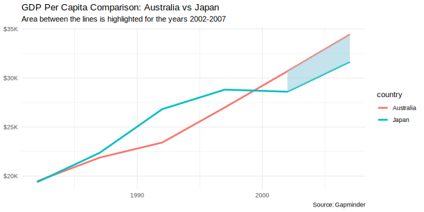
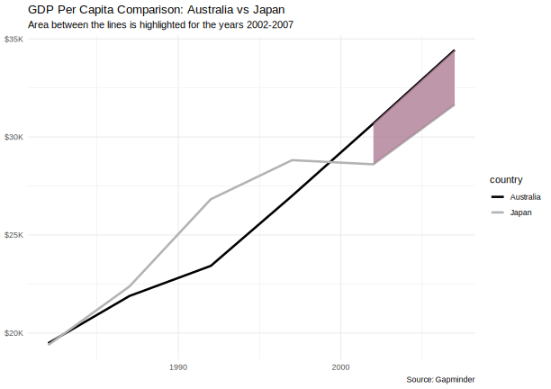

# Combine line chart and area chart
David Keyes
2024-09-16

**How to Create a Line Chart with Two Lines and a Filled Area Between
Them for a Specific Part of the Chart**

In this guide, I’ll walk you through the steps of creating a line chart
with two lines, where the area between the lines is filled only for a
specific portion of the chart. We will use GDP per capita data from the
Gapminder dataset and the `tidyverse` package in R.

The final plot will feature two lines showing GDP per capita over time
for two countries, and we’ll fill the area between them for a defined
period.

## Step 1: Load the Necessary Libraries

First, we need to load the `tidyverse` package, which includes `ggplot2`
for plotting and `dplyr` for data manipulation. We’ll also be using the
`gapminder` dataset that comes preloaded with the `gapminder` package.
It contains data about life expectancy, GDP per capita, and population
for different countries over time.

``` r
library(tidyverse)
library(gapminder)
```

## Step 2: Filter the Data

We’ll focus on two specific countries (e.g., “Australia” and “Japan”)
and plot their GDP per capita over time. To do this, we’ll filter the
dataset accordingly.

``` r
gdp_data <- gapminder |>
   filter(country %in% c("Japan", "Australia")) |>
   filter(year >= 1982) |>
   select(year, country, gdpPercap)
```

Now that we’ve filtered the data to include only Australia and Japan
after 1982, let’s take a look at it:

``` r
gdp_data
#> # A tibble: 12 × 3
#>     year country   gdpPercap
#>    <int> <fct>         <dbl>
#>  1  1982 Australia    19477.
#>  2  1987 Australia    21889.
#>  3  1992 Australia    23425.
#>  4  1997 Australia    26998.
#>  5  2002 Australia    30688.
#>  6  2007 Australia    34435.
#>  7  1982 Japan        19384.
#>  8  1987 Japan        22376.
#>  9  1992 Japan        26825.
#> 10  1997 Japan        28817.
#> 11  2002 Japan        28605.
#> 12  2007 Japan        31656.
```

## Step 3: Create a Basic Line Plot

To begin, we’ll create a basic line chart that shows the GDP per capita
for both Australia and Japan over time, using the `geom_line()`
function.

``` r
ggplot(gdp_data, aes(x = year, y = gdpPercap, color = country)) +
   geom_line(size = 1.2)
```


## Step 4: Highlight the Area Between the Two Lines for a Specific Time Period

### 4.1: Filter Data for the Highlighted Area

We’ll focus on a specific time period to fill the area between the two
lines. Let’s say we want to highlight the period **between 2000 and
2010**. We’ll first filter the data to include only that range of years:

``` r
highlight_data <- gdp_data |>
   filter(year > 2000 & year < 2010)

highlight_data
#> # A tibble: 4 × 3
#>    year country   gdpPercap
#>   <int> <fct>         <dbl>
#> 1  2002 Australia    30688.
#> 2  2007 Australia    34435.
#> 3  2002 Japan        28605.
#> 4  2007 Japan        31656.
```

We’ll need to reshape the data so that the GDP per capita for both
countries appears in separate columns.

``` r
highlight_data_wide <- highlight_data |>
   pivot_wider(names_from = country, values_from = gdpPercap)

highlight_data_wide
#> # A tibble: 2 × 3
#>    year Australia  Japan
#>   <int>     <dbl>  <dbl>
#> 1  2002    30688. 28605.
#> 2  2007    34435. 31656.
```

### 4.2: Create a Filled Area Between the Lines

To fill the area between the lines, we can use `geom_ribbon()`. This
will help us **shade** the region between the two lines during the
specified time period.

``` r
ggplot() +
   geom_line(
      data = gdp_data,
      aes(
         x = year,
         y = gdpPercap,
         color = country
      ),
      size = 1.2
   ) +
   geom_ribbon(
      data = highlight_data_wide,
      aes(x = year, ymin = Japan, ymax = Australia),
      fill = "#ADD8E6",
      alpha = 0.5
   )
```



## Step 5: Customize the Plot

Now we’ll customize the plot to make it more visually appealing.

### 5.1: Add Labels and Titles

We’ll add a title and a caption for the data source, using the `labs()`
function:

``` r
ggplot() +
   geom_ribbon(
      data = highlight_data_wide,
      aes(x = year, ymin = Japan, ymax = Australia),
      fill = "#ADD8E6",
      alpha = 0.5
   ) +
   geom_line(
      data = gdp_data,
      aes(
         x = year,
         y = gdpPercap,
         color = country
      ),
      size = 1.2
   ) +
   labs(
      title = "GDP Per Capita Comparison: Australia vs Japan",
      subtitle = "Area between the lines is highlighted for the years 2002-2007",
      x = NULL,
      y = "GDP Per Capita",
      caption = "Source: Gapminder"
   )
```



### 5.2: Improve the Color Scheme and Theme

We’ll refine the colors and use a minimal theme (via `theme_minimal()`)
to make the chart cleaner. We customize text style with the `theme()`
function:

``` r
ggplot() +
   geom_ribbon(
      data = highlight_data_wide,
      aes(x = year, ymin = Japan, ymax = Australia),
      fill = "#ADD8E6",
      alpha = 0.5
   ) +
   geom_line(
      data = gdp_data,
      aes(
         x = year,
         y = gdpPercap,
         color = country
      ),
      size = 1.2
   ) +
   scale_color_manual(values = c("Japan" = "#FF6347", "Australia" = "#4682B4")) +
   labs(
      title = "GDP Per Capita Comparison: Australia vs Japan",
      subtitle = "Area between the lines is highlighted for the years 2002-2007",
      x = NULL,
      y = "GDP Per Capita",
      caption = "Source: Gapminder"
   ) +
   theme_minimal() +
   theme(
      plot.title = element_text(size = 18, face = "bold"),
      plot.subtitle = element_text(size = 14, margin = margin(b = 10)),
      axis.text = element_text(size = 12),
      axis.title = element_text(size = 14, face = "bold"),
      legend.title = element_blank()
   )
```


### 5.3: Annotation for the highlighted area

First, to make our code easier, let’s create variables with the
information about the region we want to highlight. For this we need: the
last year, the maximum value of both Australia and Japan, and then the
difference between them.

``` r
last_year <- 2007
max_australia <- max(gdp_data$gdpPercap[gdp_data$country == "Australia"])
max_japan <- max(gdp_data$gdpPercap[gdp_data$country == "Japan"])
difference <- max_australia - max_japan
```

Once we have those values, we use the `geom_segment()` function to add
the lines on the right of the highlighted area. Their position is
defined via the variables from above, but we add +/- 0.3 to make the
horizontal lines a bit wider.

This looks like:

``` r
geom_segment(
   aes(
      x = last_year - 0.3,
      xend = last_year + 0.3,
      y = max_japan,
      yend = max_japan
   )
)
```

Then we need to ensure that our annotation will be visible. For this we
use:

``` r
coord_cartesian(
   clip = "off",
   xlim = c(
      min(gdp_data$year),
      max(gdp_data$year) + 6
   )
)
```

This line extends the x-axis limit by 5 years (2007 + 5 = 2012) beyond
the maximum year in the data and allows plot elements to be drawn
outside the plot area, which is useful for positioning annotations like
the GDP gap label.

``` r
ggplot() +
   geom_ribbon(
      data = highlight_data_wide,
      aes(x = year, ymin = Japan, ymax = Australia),
      fill = "#ADD8E6",
      alpha = 0.5
   ) +
   geom_line(data = gdp_data, aes(x = year, y = gdpPercap, color = country), size = 1.2) +
   scale_color_manual(values = c("Japan" = "#FF6347", "Australia" = "#4682B4")) +
   labs(
      title = "GDP Per Capita Comparison: Australia vs Japan",
      subtitle = "Area between the lines is highlighted for the years 2002-2007",
      x = "Year",
      y = "GDP Per Capita",
      caption = "Source: Gapminder"
   ) +
   theme_minimal() +
   theme(
      plot.title = element_text(size = 14, face = "bold"),
      plot.subtitle = element_text(size = 10, margin = margin(b = 10)),
      axis.text = element_text(size = 12),
      axis.title = element_text(size = 10, face = "bold"),
      legend.title = element_blank()
   ) +
   geom_segment(
      aes(x = last_year, xend = last_year, y = max_japan, yend = max_australia),
      linetype = "dashed"
   ) +
   geom_segment(
      aes(x = last_year - 0.3, xend = last_year + 0.3, y = max_japan, yend = max_japan)
   ) +
   geom_segment(
      aes(x = last_year - 0.3, xend = last_year + 0.3, y = max_australia, yend = max_australia)
   ) +
   geom_label(
      aes(x = last_year + 1, y = (max_australia + max_japan) / 2),
      label = paste0(round(difference, -1), " GDP\nper capita gap"),
      hjust = 0,
      vjust = 0.5,
      size = 3
   ) +
   coord_cartesian(clip = "off", xlim = c(1982, 2012))
```


You now have a polished line chart comparing GDP per capita between
Australia and Japan. The area between the two lines is filled for the
years 2002-2007, making it easy to visually compare their economic
performance during that period.

This technique is a great way to highlight differences between two
variables over a specific range of time, helping the viewer focus on key
periods of interest in the data.
