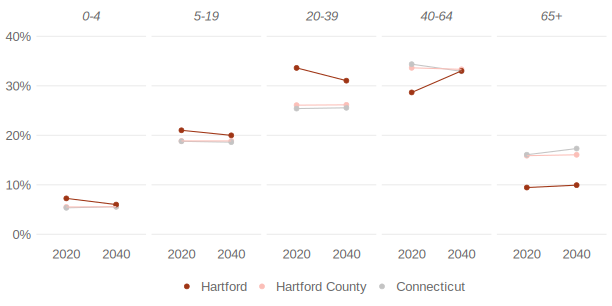
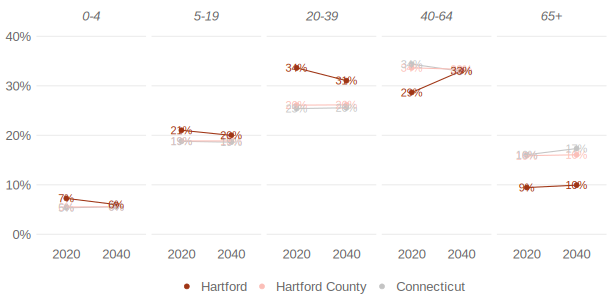
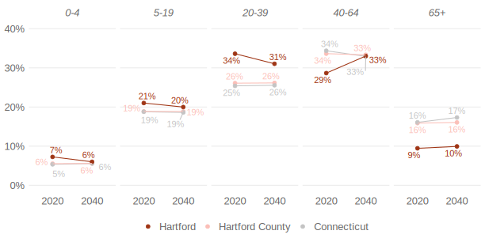

# Use smart labeling in ggplot to help your audience understand your
graphs
David Keyes
2024-10-24

When making data viz in R, it’s easy to think that adding label to
everything will make your charts easier to understand. This is rarely
the case. Instead, when making charts, maps, etc with ggplot, your best
bet is to label smartly. Only labeling the most important pieces of your
data viz ensures that your audience will grasp what you want them to
grasp. In this blog post, I’ll show you how to use smart labeling in
ggplot to help your audience understand your graphs.

## An example

The issue of smart labeling came up in our work with the [Partnership
for Strong Communities](https://www.pschousing.org/) (PSC) and the
[Connecticut Data Collaborative](https://www.ctdata.org/) (CTData)
making [housing data profiles for all towns and counties in
Connecticut](https://rfortherestofus.com/success-stories/pschousing).
One graph in the reports aims to show population projections for various
age groups. Here, for example, is the chart we made for the city of
Hartford.


Note how the only text we add to the graphs is that for the city of
Hartford. While there are lines that show trends in Hartford County and
Connecticut, we don’t try to label these. If we did, the result would be
completely illegible:


How, then, do you decide what text to add and what to leave off? The
answer comes down to a simple question that you should ask yourself
before making any graph: what do you want the reader to take from the
graph?

When working on the population projection plots for the Connecticut
Housing Data Profiles, we wanted to highlight the city (the county and
state were there for comparison). So, when adding text to this plot, we
didn’t try to label everything; instead, we only labeled the values for
Hartford.

How did we do this in ggplot? The answer is actually less about ggplot
and more about getting our data in the right format using other
tidyverse packages like {dplyr}. To show you what I mean, let’s look at
the data. I’ll begin by loading the tidyverse.

``` r
library(tidyverse)
```

Now, we can read in the data, saved as an RDS file.

``` r
population_projection <- 
  read_rds("population_projection.rds")
```

Next, we can look at the data for Hartford:

``` r
population_projection |>
  filter(location == "Hartford")
#> # A tibble: 10 × 5
#>    location year  age_group    pct pct_formatted
#>    <chr>    <chr> <fct>      <dbl> <chr>        
#>  1 Hartford 2020  0-4       0.0725 7%           
#>  2 Hartford 2020  5-19      0.210  21%          
#>  3 Hartford 2020  20-39     0.336  34%          
#>  4 Hartford 2020  40-64     0.287  29%          
#>  5 Hartford 2020  65+       0.0945 9%           
#>  6 Hartford 2040  0-4       0.0600 6%           
#>  7 Hartford 2040  5-19      0.200  20%          
#>  8 Hartford 2040  20-39     0.310  31%          
#>  9 Hartford 2040  40-64     0.330  33%          
#> 10 Hartford 2040  65+       0.0993 10%
```

With this data loaded, we can make a function to create our population
projection plot. This plot takes two arguments: `town_to_plot` and
`county_to_plot`. From there, it filters the `population_projection`
data to only include the town, county, and Connecticut. This data is
then piped into ggplot, where we make a set of slope graphs (one for
each age group) to show the population projections from 2020 to 2040.
The function below, with explanatory comments throughout, shows how this
all works.

``` r
population_projection_plot <- function(town_to_plot, county_to_plot) {
  population_projection |>
    # Filter the data to only include town, county, and Connecticut
    filter(location %in% c(town_to_plot, county_to_plot, "Connecticut")) |>
    # Make location a factor to ensure the town line shows up on top of the others
    mutate(location = fct(
      location,
      levels = c("Connecticut", county_to_plot, town_to_plot)
    )) |>
    ggplot(aes(
      x = year,
      y = pct,
      color = location,
      group = location
    )) +
    # Add dot for each town/county/state in 2020 and 2040
    geom_point(size = 2) +
    # Add line connecting each town/county/state
    geom_line(show.legend = FALSE) +
    # Remote legend title
    labs(color = NULL) +
    # Make the chart faceted by age group
    facet_wrap(
      vars(age_group),
      nrow = 1
    ) +
    # Set the y limits to go from 0% to 40%
    # Use percent formatting from the {scales} package
    scale_y_continuous(
      limits = c(0, 0.4),
      labels = scales::percent_format(1)
    ) +
    # Set the colors for town, county, and state
    scale_color_manual(
      values = c(
        "#c4c4c4",
        "#fbbfb8",
        "#9f3515"
      )
    ) +
    # Reverse the legend order to put the town first
    guides(color = guide_legend(reverse = TRUE)) +
    # Use theme_minimal() and then make additional tweaks
    theme_minimal() +
    theme(
      panel.grid.minor = element_blank(),
      panel.grid.major.x = element_blank(),
      legend.position = "bottom",
      strip.text = element_text(
        face = "italic",
        size = 13,
        color = "grey40"
      ),
      legend.text = element_text(
        size = 13,
        color = "grey40"
      ),
      axis.title = element_blank(),
      axis.text = element_text(
        size = 13,
        color = "grey40"
      )
    )
}
```

We can now use our function as follows:

``` r
population_projection_plot(
  town_to_plot = "Hartford",
  county_to_plot = "Hartford County"
)
```



As you can see, the function only adds points and lines. If we want to
add labels, we’ll need to add another layer using `geom_text()`. We can
use the `pct_formatted` variable for the text labels, as follows (the
`show.legend = FALSE` ensures that no unnecessary text elements get
added to the legend).

``` r
population_projection_plot(
  town_to_plot = "Hartford",
  county_to_plot = "Hartford County"
) +
  geom_text(
    aes(
      label = pct_formatted
    ),
    show.legend = FALSE
  )
```

This, however, gives us the less-than-ideal plot we saw before, with all
of the labels overlapping each other:



One approach I’ve seen people use in this situation is the [{ggrepel}
package](https://ggrepel.slowkow.com/). This package, which
automatically ensures that text labels don’t overlap can be quite
helpful in certain situations. But in this situation, the result is
still quite messy.

``` r
library(ggrepel)

population_projection_plot(
  town_to_plot = "Hartford",
  county_to_plot = "Hartford County"
) +
  geom_text_repel(
    aes(
      label = pct_formatted
    ),
    show.legend = FALSE
  ) 
```



The solution, then, is to only add text for Hartford, and not for
Hartford County and Connecticut. To do this, I use `geom_text()`, but
within this layer, I filter the data to only include Hartford.

``` r
population_projection_plot(
  town_to_plot = "Hartford",
  county_to_plot = "Hartford County"
) +
  geom_text(
    data = population_projection |> filter(location == "Hartford"),
    nudge_y = 0.03,
    aes(
      label = pct_formatted
    ),
    show.legend = FALSE
  )
```

Doing this gives me labels for Hartford, but not Hartford County and
Connecticut. The result is much clearer.


When making plots in ggplot, it can be tempting to label everything. But
this is rarely an ideal approach. You often end up with overlapping
text. And, more importantly, too much text makes things less clear for
your reader.

Instead, the best solution is to start by identifying what you want your
reader to focus on. From there, you can add text to highlight that
thing. In this example, I filtered data within `geom_text()` to only
show text labels for the city we care about (in this case, Hartford).
Doing this makes your data viz clear for your readers.
