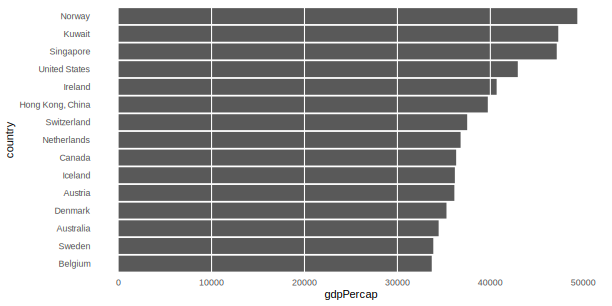

# Use vertical lines instead of an x-axis
David Keyes
2024-09-16

How do you create a horizontal bar plot in `ggplot2` without an x-axis
but with vertical white lines as value references? This guide will walk
you through the steps to create a polished bar plot using GDP per capita
data from the Gapminder dataset, using the `tidyverse` package in R.

We’ll create a horizontal bar plot showing the GDP per capita for
different countries, where we hide the x-axis and instead use vertical
white lines as value references.

## Step 1: Load the Necessary Libraries

First, we need to load the `tidyverse` package, which includes `ggplot2`
for plotting and `dplyr` for data manipulation.

``` r
library(tidyverse)
library(gapminder)
```

We’ll be using the `gapminder` dataset that comes preloaded with the
`gapminder` package. It contains data about life expectancy, GDP per
capita, and population for different countries over time.

## Step 2: Filter the Data

We’ll focus on the most recent data in the dataset, which is from 2007,
and select the top 10 countries by GDP per capita.

``` r
gdp_data <- gapminder %>%
   filter(year == 2007) %>%
   select(country, gdpPercap) %>%
   arrange(desc(gdpPercap)) %>%
   slice(1:15)
```

Now, let’s take a look at the top rows of our filtered dataset:

``` r
head(gdp_data)
#> # A tibble: 6 × 2
#>   country          gdpPercap
#>   <fct>                <dbl>
#> 1 Norway              49357.
#> 2 Kuwait              47307.
#> 3 Singapore           47143.
#> 4 United States       42952.
#> 5 Ireland             40676.
#> 6 Hong Kong, China    39725.
```

## Step 3: Create a Basic Horizontal Bar Plot

We will now create a basic horizontal bar plot to visualize the GDP per
capita for each country.

``` r
ggplot(gdp_data, aes(x = reorder(country, gdpPercap), y = gdpPercap)) +
   geom_col() +
   coord_flip()
```


This creates a basic horizontal bar plot, but it’s still missing the
customizations we want, like removing the x-axis and adding vertical
white lines.

## Step 4: Customize the Plot

### 4.1 Remove the X-Axis

Next, we’ll remove the x-axis (since the bars are horizontal, this
refers to the axis along the bottom). We’ll do this by using `theme()`
and setting `panel.grid.major` and `panel.grid.minor` to
`element_blank()`.

*Note: we apply this parameter to the x and y axes, as it is not
necessary for the y axis.*

``` r
ggplot(gdp_data, aes(x = reorder(country, gdpPercap), y = gdpPercap)) +
   geom_col(fill = "#69b3a2") +
   coord_flip() +
   theme_minimal() +
   theme(
      panel.grid.major.x = element_blank(),
      panel.grid.minor.x = element_blank(),
      panel.grid.major.y = element_blank(),
      panel.grid.minor.y = element_blank()
   )
```


### 4.2 Add Vertical White Lines as Value References

To add vertical white lines in place of the x-axis, we’ll use
`geom_hline()`. This function allows us to add vertical lines at
specified positions because we are also applying `coord_flip()` to our
graph to swap the x and y axes.

We’ll place the lines at intervals across the y-axis values to help the
viewer estimate the GDP per capita.

``` r
ggplot(gdp_data, aes(x = reorder(country, gdpPercap), y = gdpPercap)) +
   geom_col(fill = "#69b3a2") +
   geom_hline(
      yintercept = seq(10000, max(gdp_data$gdpPercap), by = 10000),
      color = "lightgrey",
      linewidth = 0.4
   ) +
   coord_flip() +
   theme_minimal() +
   theme(
      panel.grid.major.x = element_blank(),
      panel.grid.minor.x = element_blank(),
      panel.grid.major.y = element_blank(),
      panel.grid.minor.y = element_blank()
   )
```



### 4.3 Improve overall style

- Changed the **bar color** to a more visually appealing blue
  (`#3498db`).
- Used the Roboto **font** family for better readability.
- Improved the title, added a subtitle, and included a caption for the
  data source.
- Formatted the y-axis labels to **show values in thousands** (e.g., 20k
  instead of 20000).
- Adjusted text sizes, colors, and margins for better visual hierarchy.
- Changed the gridlines to **dashed lines** with a light color for less
  visual clutter.
- Added more **padding** around the plot.

``` r
library(extrafont)
library(scales)

ggplot(gdp_data, aes(x = reorder(country, gdpPercap), y = gdpPercap)) +
   geom_col(fill = "#3498db", width = 0.7) +
   geom_hline(
      yintercept = seq(10000, max(gdp_data$gdpPercap), by = 10000),
      color = "#c2cfc5", linewidth = 0.5, linetype = "dashed"
   ) +
   coord_flip() +
   scale_y_continuous(
      labels = scales::dollar_format(scale = 1 / 1000, suffix = "k"),
      breaks = seq(0, max(gdp_data$gdpPercap), by = 10000)
   ) +
   theme_minimal(base_family = "Roboto") +
   labs(
      x = NULL,
      y = "GDP Per Capita",
      title = "GDP Per Capita in 2007",
      subtitle = "Based on Gapminder Data",
      caption = "Source: Gapminder"
   ) +
   theme(
      axis.text.y = element_text(size = 10, color = "#2c3e50"),
      axis.text.x = element_text(size = 10, color = "#2c3e50"),
      axis.title.x = element_text(size = 12, face = "bold", margin = margin(t = 10)),
      panel.grid.major = element_blank(),
      panel.grid.minor = element_blank(),
      plot.title = element_text(size = 20, face = "bold", color = "#2c3e50", margin = margin(b = 10)),
      plot.subtitle = element_text(size = 14, color = "#7f8c8d", margin = margin(b = 20)),
      plot.caption = element_text(size = 10, color = "#7f8c8d", margin = margin(t = 10)),
      plot.margin = margin(20, 20, 20, 20)
   )
```


## Final Result

By following these steps, you now have a clean, polished horizontal bar
plot that uses vertical white lines as reference points for GDP per
capita values. The x-axis has been removed for a cleaner look, but the
vertical lines give viewers a guide for interpreting the values.

This chart is a useful visualization tool for comparing GDP per capita
across countries without the clutter of an x-axis, making the data easy
to interpret at a glance.
